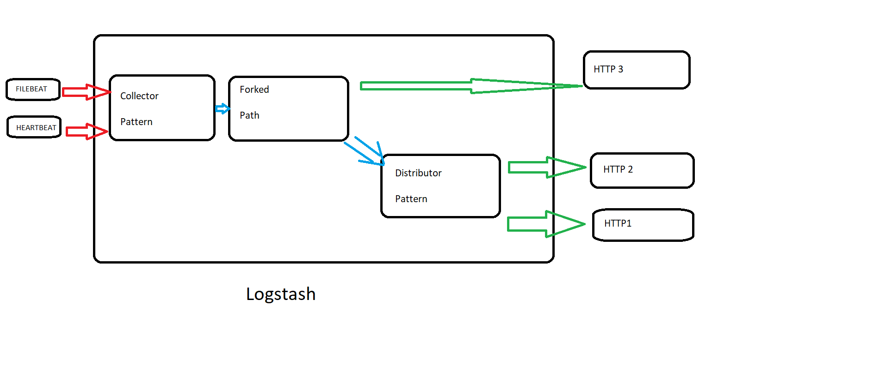

# Ejercicio Logstash

A continuación mostramos el esquema para realizar el ejercicio:

*Esquema para el ejercicio 2*

Vamos enumerar los distintos pipelines y su uso

1.  Comenzamos con un collector pattern puesto que recibimos información de dos fuentes distintas.
2.  El siguiente patrón será un forked path pattern ya que a unos mismos datos le vamos a dar dos procesamientos distintos. Una de las salidas de este patrón irá directamente al tercer servidor http puesto que se pedía que este hiciera uso de las dos fuentes de datos y la otra salida irá a un distributos pattern.
3. El último patrón que utilizamos será distributor pattern puesto que tenemos datos de dos fuentes y lo que queremos es aplicar un procesamiento distinto a estos datos únicos y mandarlos a cada uno de los servidores http.